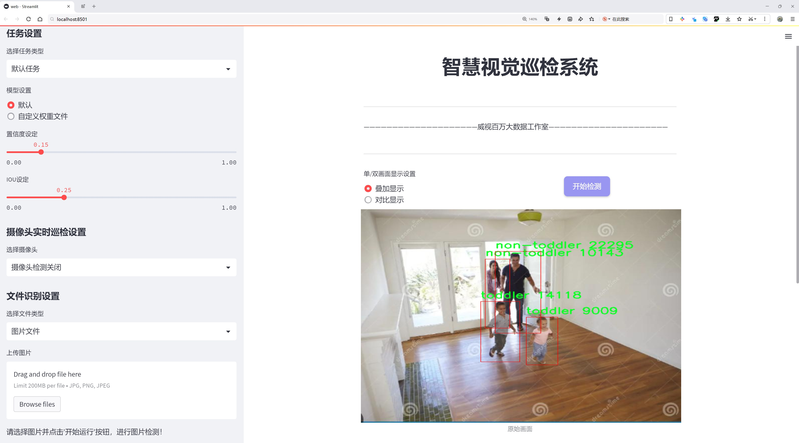
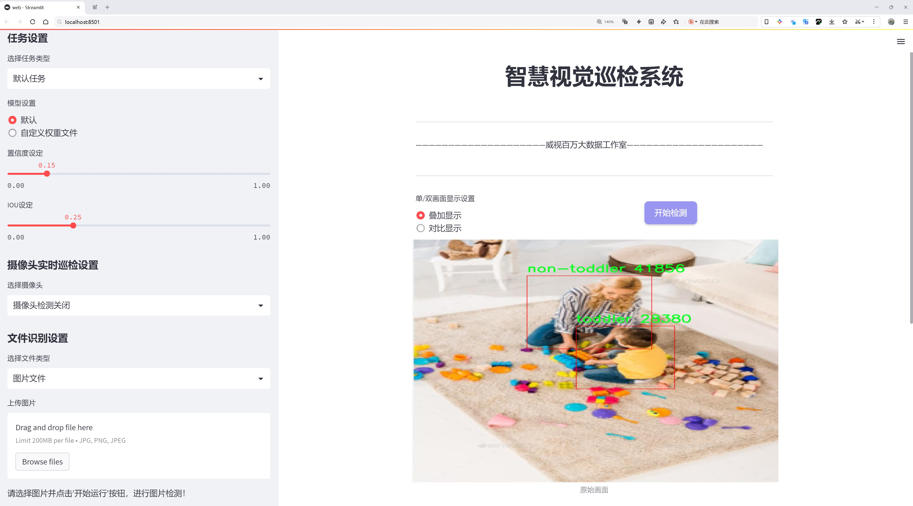
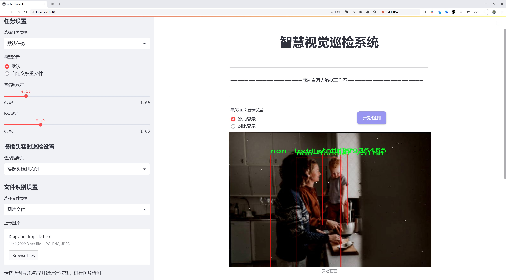
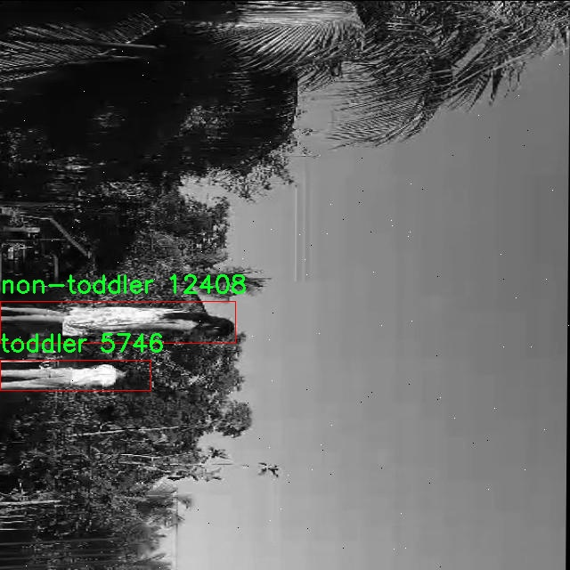
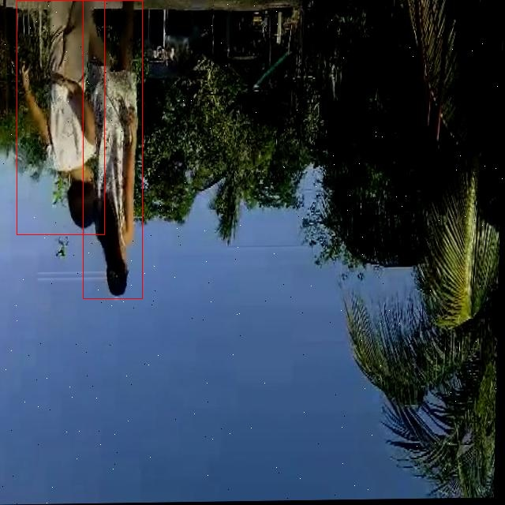
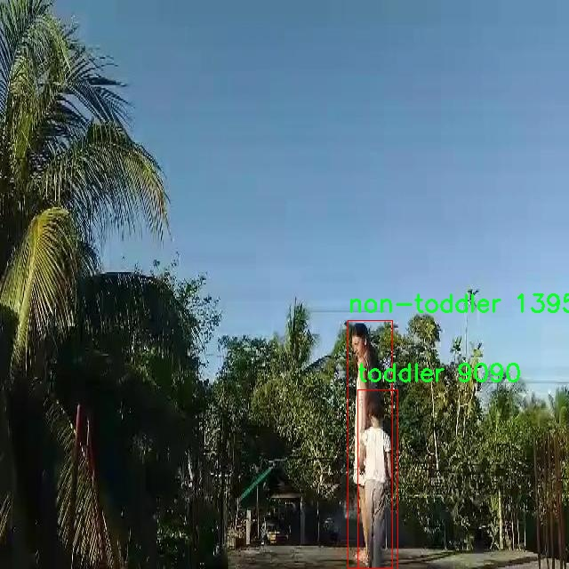
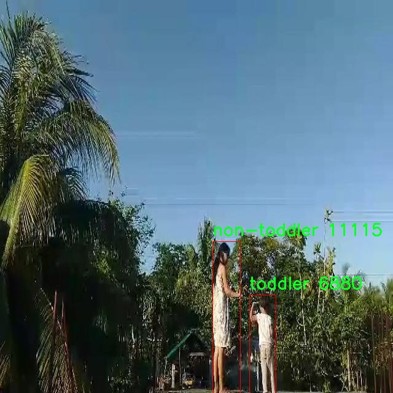
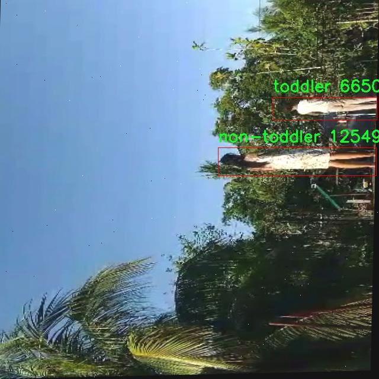

# 幼儿与非幼儿识别检测系统源码分享
 # [一条龙教学YOLOV8标注好的数据集一键训练_70+全套改进创新点发刊_Web前端展示]

### 1.研究背景与意义

项目参考[AAAI Association for the Advancement of Artificial Intelligence](https://gitee.com/qunshansj/projects)

项目来源[AACV Association for the Advancement of Computer Vision](https://gitee.com/qunmasj/projects)

研究背景与意义

随着人工智能技术的迅猛发展，计算机视觉领域在各个应用场景中展现出了巨大的潜力，尤其是在物体检测和识别方面。幼儿与非幼儿的识别作为一个特定的应用场景，近年来受到越来越多的关注。这一研究不仅涉及到儿童安全监护、教育资源的合理配置，还与社会服务、公共安全等领域密切相关。尤其是在幼儿园、托儿所等场所，能够快速、准确地识别幼儿与非幼儿的系统，能够有效提高安全管理的效率，降低意外事件的发生概率。

在此背景下，YOLO（You Only Look Once）系列模型因其出色的实时性和准确性，成为物体检测领域的热门选择。YOLOv8作为该系列的最新版本，进一步提升了检测精度和速度，具备了更强的特征提取能力和更好的小物体检测性能。然而，尽管YOLOv8在一般物体检测任务中表现优异，但在特定场景下，尤其是幼儿与非幼儿的识别任务中，仍然存在一定的挑战。这主要体现在数据集的多样性和模型的适应性上。因此，基于改进YOLOv8的幼儿与非幼儿识别系统的研究具有重要的现实意义。

本研究将使用一个包含3500张图像的数据集，该数据集分为两个类别：幼儿（toddler）和非幼儿（non-toddler）。数据集的构建不仅需要考虑图像的数量，还需关注图像的多样性和代表性，以确保模型在实际应用中的泛化能力。通过对数据集的深入分析，我们可以识别出不同类别之间的特征差异，从而为模型的改进提供依据。特别是在幼儿与非幼儿的外观特征、行为模式等方面，进行细致的研究将有助于提升模型的识别准确率。

此外，改进YOLOv8的过程将包括对模型架构的优化、超参数的调整以及数据增强技术的应用。这些改进不仅能够提升模型的性能，还能够提高其在复杂环境下的鲁棒性。例如，通过引入注意力机制，可以使模型更加关注图像中与幼儿相关的特征，从而减少误识别的概率。同时，数据增强技术的应用将使得模型在面对不同光照、角度和背景等变化时，依然能够保持较高的识别率。

综上所述，基于改进YOLOv8的幼儿与非幼儿识别系统的研究，不仅为计算机视觉领域提供了新的思路和方法，也为实际应用中的安全管理和资源配置提供了有力的技术支持。随着社会对儿童安全问题的日益重视，该研究的成果将为相关领域的研究和实践提供重要的参考价值，推动智能监控技术的发展，提升社会对幼儿保护的整体水平。

### 2.图片演示







##### 注意：由于此博客编辑较早，上面“2.图片演示”和“3.视频演示”展示的系统图片或者视频可能为老版本，新版本在老版本的基础上升级如下：（实际效果以升级的新版本为准）

  （1）适配了YOLOV8的“目标检测”模型和“实例分割”模型，通过加载相应的权重（.pt）文件即可自适应加载模型。

  （2）支持“图片识别”、“视频识别”、“摄像头实时识别”三种识别模式。

  （3）支持“图片识别”、“视频识别”、“摄像头实时识别”三种识别结果保存导出，解决手动导出（容易卡顿出现爆内存）存在的问题，识别完自动保存结果并导出到tempDir中。

  （4）支持Web前端系统中的标题、背景图等自定义修改，后面提供修改教程。

  另外本项目提供训练的数据集和训练教程,暂不提供权重文件（best.pt）,需要您按照教程进行训练后实现图片演示和Web前端界面演示的效果。

### 3.视频演示

[3.1 视频演示](https://www.bilibili.com/video/BV1ZntxeaE6Q/)

### 4.数据集信息展示

##### 4.1 本项目数据集详细数据（类别数＆类别名）

nc: 2
names: ['non-toddler', 'toddler']


##### 4.2 本项目数据集信息介绍

数据集信息展示

在本研究中，我们采用了名为“final_toddler_vs_non-toddler”的数据集，以训练和改进YOLOv8模型，旨在实现对幼儿与非幼儿的高效识别。该数据集专门设计用于解决幼儿识别领域中的一些关键挑战，特别是在复杂环境下的准确性和实时性。数据集的类别数量为2，具体包括“non-toddler”（非幼儿）和“toddler”（幼儿）两个类别。这一分类设计不仅能够有效地帮助模型区分不同年龄段的个体，还能为后续的应用提供更为清晰的目标识别框架。

在数据集的构建过程中，研究团队对样本的多样性和代表性进行了精心考量。为了确保模型的泛化能力，数据集中包含了多种场景下的图像，包括室内和室外环境、不同光照条件、以及各种背景杂乱程度。这种多样性使得模型在实际应用中能够更好地适应不同的识别场景，从而提高其准确性和鲁棒性。此外，数据集中的图像涵盖了不同种族、性别和穿着风格的幼儿与非幼儿个体，进一步增强了模型的适应性和公平性。

在数据标注方面，所有图像均经过严格的人工标注，确保每个样本的标签准确无误。标注过程中，研究团队采用了高标准的质量控制流程，确保每个图像中的幼儿和非幼儿个体都被正确识别和标记。这一过程不仅提高了数据集的质量，也为后续的模型训练提供了坚实的基础。数据集的每个样本都附带了详细的元数据，包括拍摄时间、地点以及图像的拍摄条件等信息，这些信息在模型训练和评估过程中也起到了重要的参考作用。

为了进一步提升模型的性能，研究团队还对数据集进行了多种数据增强处理，如随机裁剪、旋转、缩放和颜色调整等。这些数据增强技术不仅丰富了训练样本的多样性，还有效地防止了模型的过拟合现象，使得模型在面对未见样本时能够保持较高的识别精度。通过这些手段，最终形成的“final_toddler_vs_non-toddler”数据集为YOLOv8模型的训练提供了强有力的支持。

在实验阶段，研究团队将数据集划分为训练集、验证集和测试集，以确保模型在不同阶段的评估和调优。训练集用于模型的初步训练，验证集用于调整模型参数，而测试集则用于最终的性能评估。通过这种系统化的划分，研究团队能够全面了解模型在各个阶段的表现，并据此进行相应的优化。

综上所述，“final_toddler_vs_non-toddler”数据集不仅在数量和质量上都达到了高标准，更在多样性和适应性方面为YOLOv8模型的训练提供了强有力的支持。随着模型的不断优化，我们期待能够在幼儿与非幼儿的识别任务中取得更为显著的成果，为相关领域的研究和应用提供重要的参考和借鉴。











### 5.全套项目环境部署视频教程（零基础手把手教学）

[5.1 环境部署教程链接（零基础手把手教学）](https://www.ixigua.com/7404473917358506534?logTag=c807d0cbc21c0ef59de5)


[5.2 安装Python虚拟环境创建和依赖库安装视频教程链接（零基础手把手教学）](https://www.ixigua.com/7404474678003106304?logTag=1f1041108cd1f708b01a)

### 6.手把手YOLOV8训练视频教程（零基础小白有手就能学会）

[6.1 手把手YOLOV8训练视频教程（零基础小白有手就能学会）](https://www.ixigua.com/7404477157818401292?logTag=d31a2dfd1983c9668658)

### 7.70+种全套YOLOV8创新点代码加载调参视频教程（一键加载写好的改进模型的配置文件）

[7.1 70+种全套YOLOV8创新点代码加载调参视频教程（一键加载写好的改进模型的配置文件）](https://www.ixigua.com/7404478314661806627?logTag=29066f8288e3f4eea3a4)

### 8.70+种全套YOLOV8创新点原理讲解（非科班也可以轻松写刊发刊，V10版本正在科研待更新）

由于篇幅限制，每个创新点的具体原理讲解就不一一展开，具体见下列网址中的创新点对应子项目的技术原理博客网址【Blog】：


[8.1 70+种全套YOLOV8创新点原理讲解链接](https://gitee.com/qunmasj/good)

### 9.系统功能展示（检测对象为举例，实际内容以本项目数据集为准）

图9.1.系统支持检测结果表格显示

  图9.2.系统支持置信度和IOU阈值手动调节

  图9.3.系统支持自定义加载权重文件best.pt(需要你通过步骤5中训练获得)

  图9.4.系统支持摄像头实时识别

  图9.5.系统支持图片识别

  图9.6.系统支持视频识别

  图9.7.系统支持识别结果文件自动保存

  图9.8.系统支持Excel导出检测结果数据


### 10.原始YOLOV8算法原理

原始YOLOv8算法原理

YOLOv8算法是目标检测领域的最新进展，承载着对YOLO系列模型的进一步优化与创新。该算法在保持高效性的同时，力求在准确性上取得突破，成为当前最优秀的目标检测算法之一。其核心思想围绕着深度学习的特征提取与多尺度信息融合展开，结合了跨级结构（Cross Stage Partial, CSP）和轻量化设计，旨在实现快速而精准的目标检测。

在YOLOv8的骨干网络中，CSP结构依然是其基础，但与之前的YOLOv5相比，YOLOv8对C3模块进行了优化，采用了更为轻量的C2f模块。这一变化不仅减小了模型的计算复杂度，还提高了特征提取的效率。C2f模块的设计灵感来源于YOLOv7中的ELAN结构，通过引入更多的跳层连接，增强了梯度流动，确保了模型在训练过程中的稳定性和收敛速度。此外，YOLOv8依然保留了空间金字塔池化（SPPF）模块，这一模块的存在使得模型能够有效地捕捉到不同尺度的特征，进一步提升了目标检测的性能。

YOLOv8的网络结构可以分为三个主要部分：Backbone、Neck和Head。Backbone部分通过一系列卷积和反卷积层提取特征，并利用残差连接和瓶颈结构来减小网络的规模，同时提高其性能。具体而言，Backbone由五个CBS模块、四个C2f模块和一个快速空间金字塔池化模块组成。这种设计使得YOLOv8能够在保证特征提取能力的同时，降低计算负担。

在Neck部分，YOLOv8采用了多尺度特征融合技术，整合来自Backbone不同阶段的特征图。这一过程不仅增强了模型对不同尺度目标的感知能力，还提高了整体的鲁棒性。通过有效地融合多层次的特征信息，YOLOv8能够更好地捕捉到目标的细节与背景信息，从而在复杂场景中依然保持较高的检测精度。

Head部分则负责最终的目标检测与分类任务。YOLOv8设计了三个检测头，分别用于处理不同尺寸的目标信息。这些检测头包含了一系列卷积层和反卷积层，旨在生成准确的检测结果。与以往的YOLO系列模型不同，YOLOv8引入了无锚框结构，直接预测目标的中心位置。这一创新使得模型在定位和分类任务上能够更高效地进行学习与优化。

在损失函数的设计上，YOLOv8采用了新的损失策略，结合变焦损失计算分类损失，并通过数据平均保真度损失和完美交并比损失来计算边界框损失。这种损失策略的引入，使得YOLOv8在目标检测时能够更加准确地评估分类与定位的效果，进一步提升了模型的整体性能。

值得注意的是，YOLOv8在训练过程中对数据增强策略进行了调整。尽管Mosaic数据增强在一定程度上提升了模型的鲁棒性与泛化能力，但其也可能导致模型学习到不真实的分布信息。因此，YOLOv8在训练的最后10个epoch中停止使用Mosaic数据增强，以确保模型能够更好地适应真实场景中的数据分布。

综上所述，YOLOv8算法通过一系列的结构优化与创新设计，成功实现了在目标检测任务中的高效性与准确性。其在Backbone、Neck和Head三个部分的改进，使得模型能够更好地处理复杂的视觉信息，尤其是在多尺度目标检测方面展现出优越的性能。通过结合新的损失策略与数据增强方法，YOLOv8不仅在检测精度上有所提升，同时也在推理速度上保持了较高的效率。这些特性使得YOLOv8在实际应用中具有广泛的适用性和研究价值，尤其是在需要实时性与准确性兼顾的场景中，如智能监控、自动驾驶和机器人视觉等领域。随着YOLOv8的不断发展与应用，其在目标检测领域的影响力将愈加显著，推动着相关技术的进一步进步与创新。


### 11.项目核心源码讲解（再也不用担心看不懂代码逻辑）

#### 11.1 70+种YOLOv8算法改进源码大全和调试加载训练教程（非必要）\ultralytics\models\sam\modules\decoders.py

以下是对给定代码的核心部分进行分析和详细注释的结果。保留了最重要的功能，并添加了中文注释，以便更好地理解代码的结构和功能。

```python
import torch
from torch import nn
from torch.nn import functional as F
from typing import List, Tuple, Type

class MaskDecoder(nn.Module):
    """
    MaskDecoder 类用于生成掩码及其质量评分，使用变换器架构根据图像和提示嵌入预测掩码。
    """

    def __init__(
        self,
        *,
        transformer_dim: int,
        transformer: nn.Module,
        num_multimask_outputs: int = 3,
        activation: Type[nn.Module] = nn.GELU,
        iou_head_depth: int = 3,
        iou_head_hidden_dim: int = 256,
    ) -> None:
        """
        初始化 MaskDecoder。

        Args:
            transformer_dim (int): 变换器模块的通道维度
            transformer (nn.Module): 用于预测掩码的变换器
            num_multimask_outputs (int): 预测的掩码数量
            activation (nn.Module): 用于上采样掩码的激活函数
            iou_head_depth (int): 用于预测掩码质量的 MLP 深度
            iou_head_hidden_dim (int): 用于预测掩码质量的 MLP 隐藏维度
        """
        super().__init__()
        self.transformer_dim = transformer_dim
        self.transformer = transformer
        self.num_multimask_outputs = num_multimask_outputs

        # IoU token 和 mask tokens 的嵌入
        self.iou_token = nn.Embedding(1, transformer_dim)
        self.num_mask_tokens = num_multimask_outputs + 1
        self.mask_tokens = nn.Embedding(self.num_mask_tokens, transformer_dim)

        # 输出上采样网络
        self.output_upscaling = nn.Sequential(
            nn.ConvTranspose2d(transformer_dim, transformer_dim // 4, kernel_size=2, stride=2),
            nn.LayerNorm(transformer_dim // 4),
            activation(),
            nn.ConvTranspose2d(transformer_dim // 4, transformer_dim // 8, kernel_size=2, stride=2),
            activation(),
        )

        # 用于生成掩码的超网络 MLP
        self.output_hypernetworks_mlps = nn.ModuleList([
            MLP(transformer_dim, transformer_dim, transformer_dim // 8, 3) for _ in range(self.num_mask_tokens)
        ])

        # 预测掩码质量的 MLP
        self.iou_prediction_head = MLP(transformer_dim, iou_head_hidden_dim, self.num_mask_tokens, iou_head_depth)

    def forward(
        self,
        image_embeddings: torch.Tensor,
        image_pe: torch.Tensor,
        sparse_prompt_embeddings: torch.Tensor,
        dense_prompt_embeddings: torch.Tensor,
        multimask_output: bool,
    ) -> Tuple[torch.Tensor, torch.Tensor]:
        """
        根据图像和提示嵌入预测掩码。

        Args:
            image_embeddings (torch.Tensor): 图像编码器的嵌入
            image_pe (torch.Tensor): 图像嵌入的位置信息
            sparse_prompt_embeddings (torch.Tensor): 稀疏提示的嵌入
            dense_prompt_embeddings (torch.Tensor): 密集提示的嵌入
            multimask_output (bool): 是否返回多个掩码

        Returns:
            torch.Tensor: 预测的掩码
            torch.Tensor: 掩码质量的预测
        """
        masks, iou_pred = self.predict_masks(
            image_embeddings=image_embeddings,
            image_pe=image_pe,
            sparse_prompt_embeddings=sparse_prompt_embeddings,
            dense_prompt_embeddings=dense_prompt_embeddings,
        )

        # 根据 multimask_output 选择输出的掩码
        mask_slice = slice(1, None) if multimask_output else slice(0, 1)
        masks = masks[:, mask_slice, :, :]
        iou_pred = iou_pred[:, mask_slice]

        return masks, iou_pred

    def predict_masks(
        self,
        image_embeddings: torch.Tensor,
        image_pe: torch.Tensor,
        sparse_prompt_embeddings: torch.Tensor,
        dense_prompt_embeddings: torch.Tensor,
    ) -> Tuple[torch.Tensor, torch.Tensor]:
        """
        预测掩码。

        Args:
            image_embeddings (torch.Tensor): 图像编码器的嵌入
            image_pe (torch.Tensor): 图像嵌入的位置信息
            sparse_prompt_embeddings (torch.Tensor): 稀疏提示的嵌入
            dense_prompt_embeddings (torch.Tensor): 密集提示的嵌入

        Returns:
            Tuple[torch.Tensor, torch.Tensor]: 预测的掩码和 IoU 预测
        """
        # 连接输出 tokens
        output_tokens = torch.cat([self.iou_token.weight, self.mask_tokens.weight], dim=0)
        output_tokens = output_tokens.unsqueeze(0).expand(sparse_prompt_embeddings.size(0), -1, -1)
        tokens = torch.cat((output_tokens, sparse_prompt_embeddings), dim=1)

        # 扩展每张图像的数据以适应每个掩码
        src = torch.repeat_interleave(image_embeddings, tokens.shape[0], dim=0)
        src = src + dense_prompt_embeddings
        pos_src = torch.repeat_interleave(image_pe, tokens.shape[0], dim=0)

        # 运行变换器
        hs, src = self.transformer(src, pos_src, tokens)
        iou_token_out = hs[:, 0, :]
        mask_tokens_out = hs[:, 1:(1 + self.num_mask_tokens), :]

        # 上采样掩码嵌入并预测掩码
        src = src.transpose(1, 2).view(src.shape[0], self.transformer_dim, -1)
        upscaled_embedding = self.output_upscaling(src)
        hyper_in_list: List[torch.Tensor] = [
            self.output_hypernetworks_mlps[i](mask_tokens_out[:, i, :]) for i in range(self.num_mask_tokens)
        ]
        hyper_in = torch.stack(hyper_in_list, dim=1)
        masks = (hyper_in @ upscaled_embedding.view(upscaled_embedding.shape[0], -1)).view(upscaled_embedding.shape[0], -1, int(upscaled_embedding.shape[2]**0.5), int(upscaled_embedding.shape[2]**0.5))

        # 生成掩码质量预测
        iou_pred = self.iou_prediction_head(iou_token_out)

        return masks, iou_pred


class MLP(nn.Module):
    """
    MLP (多层感知器) 模型，轻微改编自 MaskFormer。
    """

    def __init__(
        self,
        input_dim: int,
        hidden_dim: int,
        output_dim: int,
        num_layers: int,
        sigmoid_output: bool = False,
    ) -> None:
        """
        初始化 MLP 模型。

        Args:
            input_dim (int): 输入特征的维度
            hidden_dim (int): 隐藏层的维度
            output_dim (int): 输出层的维度
            num_layers (int): 隐藏层的数量
            sigmoid_output (bool): 是否对输出层应用 sigmoid 激活
        """
        super().__init__()
        self.num_layers = num_layers
        h = [hidden_dim] * (num_layers - 1)
        self.layers = nn.ModuleList(nn.Linear(n, k) for n, k in zip([input_dim] + h, h + [output_dim]))
        self.sigmoid_output = sigmoid_output

    def forward(self, x):
        """执行前向传播并应用激活函数。"""
        for i, layer in enumerate(self.layers):
            x = F.relu(layer(x)) if i < self.num_layers - 1 else layer(x)
        if self.sigmoid_output:
            x = torch.sigmoid(x)
        return x
```

### 代码核心部分分析：
1. **MaskDecoder 类**：该类是掩码生成的核心，使用变换器架构来预测掩码和掩码质量。它包含多个重要的组件，如 IoU token、mask tokens、输出上采样网络和掩码质量预测 MLP。

2. **forward 方法**：该方法是模型的前向传播过程，接受图像和提示嵌入，调用 `predict_masks` 方法生成掩码和质量预测，并根据 `multimask_output` 参数选择输出。

3. **predict_masks 方法**：该方法实现了掩码的具体预测逻辑，包括将输入嵌入和提示结合，运行变换器，并通过上采样和超网络生成最终的掩码。

4. **MLP 类**：这是一个简单的多层感知器，用于生成掩码质量预测。它支持可选的 sigmoid 激活输出。

以上是对代码的核心部分和功能的详细注释和分析。

这个文件定义了一个名为 `MaskDecoder` 的类，主要用于生成图像的掩码以及与之相关的质量评分，采用了变换器（transformer）架构来预测掩码。`MaskDecoder` 类继承自 PyTorch 的 `nn.Module`，并包含多个重要的属性和方法。

在构造函数 `__init__` 中，初始化了一些关键参数，包括变换器的通道维度、变换器模块、要预测的掩码数量、激活函数、以及用于预测掩码质量的多层感知机（MLP）的深度和隐藏维度。构造函数中还定义了几个嵌入层，包括 IoU（Intersection over Union）标记的嵌入和掩码标记的嵌入，以及一个用于上采样输出的神经网络序列。

`forward` 方法是模型的前向传播函数，接收图像和提示的嵌入，并返回预测的掩码和掩码质量。该方法首先调用 `predict_masks` 方法来生成掩码，然后根据是否需要多掩码输出来选择合适的掩码和质量预测。

`predict_masks` 方法负责实际的掩码预测。它首先将 IoU 标记和掩码标记的嵌入进行拼接，并与稀疏和密集的提示嵌入结合。接着，它通过变换器处理这些输入，得到 IoU 标记和掩码标记的输出。然后，通过上采样和多个 MLP 生成最终的掩码，并预测掩码的质量。

此外，文件中还定义了一个 `MLP` 类，表示一个多层感知机模型。这个类的构造函数接收输入维度、隐藏层维度、输出维度和层数等参数，并根据这些参数构建多层线性层。在前向传播中，输入数据通过每一层进行处理，并在最后一层输出结果，若设置了 `sigmoid_output`，则会对输出应用 Sigmoid 激活函数。

整体来看，这个文件的主要功能是实现一个掩码解码器，通过变换器架构对图像进行处理，生成高质量的掩码及其质量评分，为后续的图像处理任务提供支持。

#### 11.2 70+种YOLOv8算法改进源码大全和调试加载训练教程（非必要）\ultralytics\models\sam\__init__.py

以下是代码中最核心的部分，并附上详细的中文注释：

```python
# 导入所需的模块
from .model import SAM  # 从当前包的model模块中导入SAM类
from .predict import Predictor  # 从当前包的predict模块中导入Predictor类

# 定义模块的公开接口
__all__ = 'SAM', 'Predictor'  # 指定当使用from module import *时，公开的类和函数
```

### 注释说明：
1. `from .model import SAM`：这行代码从当前包的`model`模块中导入了`SAM`类，`SAM`可能是一个用于某种模型的实现。
2. `from .predict import Predictor`：这行代码从当前包的`predict`模块中导入了`Predictor`类，`Predictor`可能是用于进行预测的工具或类。
3. `__all__ = 'SAM', 'Predictor'`：这个特殊变量`__all__`用于定义模块的公共接口，指定了当使用`from module import *`时，哪些名称是可以被导入的。在这里，只有`SAM`和`Predictor`会被导入。

这个程序文件是一个Python模块的初始化文件，通常命名为`__init__.py`，它的主要作用是将该目录标识为一个包，并可以在导入时定义该包的公共接口。

在这个文件中，首先有一行注释，表明这是与Ultralytics YOLO相关的代码，并提到该代码遵循AGPL-3.0许可证。这是一个开源许可证，允许用户自由使用、修改和分发代码，但需要遵循相应的条款。

接下来，文件从同一目录下导入了两个类：`SAM`和`Predictor`。`SAM`可能是一个与YOLOv8模型相关的类，而`Predictor`则可能是用于进行预测的类。这种导入方式使得这两个类可以在包的外部被直接使用。

最后，`__all__`变量被定义为一个元组，包含了`'SAM'`和`'Predictor'`。这个变量的作用是控制当使用`from <module> import *`语句时，哪些名称会被导入。只有在`__all__`中列出的名称才会被导入，这有助于避免不必要的名称冲突和保持模块的清晰性。

总的来说，这个`__init__.py`文件为YOLOv8相关的模型和预测功能提供了一个清晰的接口，使得用户在使用这个包时能够方便地访问所需的功能。

#### 11.3 code\ultralytics\models\yolo\detect\predict.py

以下是代码中最核心的部分，并附上详细的中文注释：

```python
from ultralytics.engine.predictor import BasePredictor
from ultralytics.engine.results import Results
from ultralytics.utils import ops

class DetectionPredictor(BasePredictor):
    """
    DetectionPredictor类扩展了BasePredictor类，用于基于检测模型进行预测。
    """

    def postprocess(self, preds, img, orig_imgs):
        """后处理预测结果并返回Results对象的列表。"""
        
        # 使用非极大值抑制（NMS）来过滤重复的检测框
        preds = ops.non_max_suppression(
            preds,                      # 预测的边界框
            self.args.conf,            # 置信度阈值
            self.args.iou,             # IOU阈值
            agnostic=self.args.agnostic_nms,  # 是否进行类别无关的NMS
            max_det=self.args.max_det, # 最大检测框数量
            classes=self.args.classes,  # 过滤特定类别
        )

        # 如果输入的原始图像不是列表，则将其转换为numpy数组
        if not isinstance(orig_imgs, list):  # 输入图像是torch.Tensor，而不是列表
            orig_imgs = ops.convert_torch2numpy_batch(orig_imgs)

        results = []  # 存储处理后的结果
        for i, pred in enumerate(preds):
            orig_img = orig_imgs[i]  # 获取对应的原始图像
            # 将预测框的坐标从缩放后的图像尺寸转换回原始图像尺寸
            pred[:, :4] = ops.scale_boxes(img.shape[2:], pred[:, :4], orig_img.shape)
            img_path = self.batch[0][i]  # 获取图像路径
            # 创建Results对象并添加到结果列表中
            results.append(Results(orig_img, path=img_path, names=self.model.names, boxes=pred))
        
        return results  # 返回处理后的结果列表
```

### 代码核心部分说明：
1. **类定义**：`DetectionPredictor`类继承自`BasePredictor`，用于实现目标检测模型的预测功能。
2. **后处理方法**：`postprocess`方法负责对模型的预测结果进行后处理，包括应用非极大值抑制（NMS）来去除重复的检测框，并将预测框的坐标从缩放后的图像尺寸转换回原始图像尺寸。
3. **结果存储**：处理后的结果被存储在`Results`对象中，并最终返回一个包含所有结果的列表。

这个程序文件是一个用于目标检测的预测器类，名为 `DetectionPredictor`，它继承自 `BasePredictor` 类。该类的主要功能是对输入的图像进行目标检测，并对检测结果进行后处理。

在文件的开头，首先导入了必要的模块，包括 `BasePredictor`、`Results` 和 `ops`。这些模块分别提供了基础预测功能、结果处理和一些操作函数。

`DetectionPredictor` 类中包含一个方法 `postprocess`，该方法负责对模型的预测结果进行后处理。具体来说，首先调用 `ops.non_max_suppression` 函数对预测结果进行非极大值抑制，以减少重叠的检测框。这个过程会根据设置的置信度阈值、IoU（交并比）阈值、是否使用类别无关的 NMS 以及最大检测框数量等参数进行处理。

接下来，方法检查输入的原始图像是否为列表。如果不是，说明输入的是一个 PyTorch 张量，这时需要将其转换为 NumPy 数组格式。随后，程序会遍历每个预测结果，并根据原始图像的尺寸对检测框进行缩放，以确保检测框与原始图像的比例一致。

最后，程序将每个处理后的结果封装成 `Results` 对象，并将其添加到结果列表中。每个 `Results` 对象包含了原始图像、图像路径、模型的类别名称以及检测框信息。最终，`postprocess` 方法返回这个结果列表。

这个类的使用示例展示了如何创建一个 `DetectionPredictor` 实例，并调用 `predict_cli` 方法进行预测。通过传入模型文件和数据源，用户可以方便地进行目标检测任务。

#### 11.4 ui.py

```python
import sys
import subprocess

def run_script(script_path):
    """
    使用当前 Python 环境运行指定的脚本。

    Args:
        script_path (str): 要运行的脚本路径

    Returns:
        None
    """
    # 获取当前 Python 解释器的路径
    python_path = sys.executable

    # 构建运行命令，使用 streamlit 运行指定的脚本
    command = f'"{python_path}" -m streamlit run "{script_path}"'

    # 执行命令
    result = subprocess.run(command, shell=True)
    # 检查命令执行的返回码，0 表示成功，非 0 表示出错
    if result.returncode != 0:
        print("脚本运行出错。")

# 主程序入口
if __name__ == "__main__":
    # 指定要运行的脚本路径
    script_path = "web.py"  # 假设脚本在当前目录下

    # 调用函数运行脚本
    run_script(script_path)
```

### 代码注释说明：
1. **导入模块**：
   - `sys`：用于获取当前 Python 解释器的路径。
   - `subprocess`：用于执行外部命令。

2. **定义 `run_script` 函数**：
   - 该函数接受一个参数 `script_path`，表示要运行的 Python 脚本的路径。
   - 函数内部首先获取当前 Python 解释器的路径，然后构建一个命令字符串，使用 `streamlit` 模块来运行指定的脚本。

3. **执行命令**：
   - 使用 `subprocess.run` 方法执行构建的命令，并将 `shell` 参数设置为 `True`，以便在 shell 中运行命令。
   - 检查命令的返回码，如果返回码不为 0，表示脚本运行出错，打印错误信息。

4. **主程序入口**：
   - 在 `if __name__ == "__main__":` 块中，指定要运行的脚本路径（这里假设为 `web.py`）。
   - 调用 `run_script` 函数来执行该脚本。

这个程序文件名为 `ui.py`，其主要功能是通过当前的 Python 环境运行一个指定的脚本。代码的结构相对简单，主要包含了导入必要的模块、定义一个函数以及在主程序中调用该函数。

首先，程序导入了几个模块，包括 `sys`、`os` 和 `subprocess`。其中，`sys` 模块用于访问与 Python 解释器相关的变量和函数，`os` 模块提供了与操作系统交互的功能，而 `subprocess` 模块则用于执行外部命令和程序。

接下来，程序从 `QtFusion.path` 模块中导入了 `abs_path` 函数，这个函数的作用是获取文件的绝对路径。

在 `run_script` 函数中，程序接受一个参数 `script_path`，这个参数是要运行的脚本的路径。函数首先获取当前 Python 解释器的路径，并将其存储在 `python_path` 变量中。然后，构建一个命令字符串，使用 `streamlit` 模块来运行指定的脚本。`streamlit` 是一个用于构建数据应用的框架。

接着，程序使用 `subprocess.run` 方法执行构建好的命令。如果命令执行的返回码不为零，表示脚本运行出错，程序会打印出相应的错误信息。

在主程序部分，首先检查是否是主模块被执行。然后，指定要运行的脚本路径，这里使用 `abs_path` 函数获取 `web.py` 的绝对路径。最后，调用 `run_script` 函数来运行指定的脚本。

整体来看，这个程序的设计目的是为了方便用户在当前的 Python 环境中运行一个名为 `web.py` 的脚本，并且能够处理可能出现的错误。

#### 11.5 70+种YOLOv8算法改进源码大全和调试加载训练教程（非必要）\ultralytics\nn\extra_modules\kernel_warehouse.py

以下是代码中最核心的部分，并附上详细的中文注释：

```python
import torch
import torch.nn as nn
import torch.nn.functional as F

class Attention(nn.Module):
    def __init__(self, in_planes, reduction, num_static_cell, num_local_mixture, norm_layer=nn.BatchNorm1d,
                 cell_num_ratio=1.0, nonlocal_basis_ratio=1.0, start_cell_idx=None):
        super(Attention, self).__init__()
        # 计算隐藏层的通道数
        hidden_planes = max(int(in_planes * reduction), 16)
        self.kw_planes_per_mixture = num_static_cell + 1  # 每个混合物的通道数
        self.num_local_mixture = num_local_mixture  # 本地混合物的数量
        self.kw_planes = self.kw_planes_per_mixture * num_local_mixture  # 总的通道数

        # 计算本地和非本地单元的数量
        self.num_local_cell = int(cell_num_ratio * num_local_mixture)
        self.num_nonlocal_cell = num_static_cell - self.num_local_cell
        self.start_cell_idx = start_cell_idx

        # 定义网络层
        self.avgpool = nn.AdaptiveAvgPool1d(1)  # 自适应平均池化
        self.fc1 = nn.Linear(in_planes, hidden_planes, bias=(norm_layer is not nn.BatchNorm1d))  # 线性层
        self.norm1 = norm_layer(hidden_planes)  # 归一化层
        self.act1 = nn.ReLU(inplace=True)  # 激活函数

        # 根据非本地基数比率选择不同的映射方式
        if nonlocal_basis_ratio >= 1.0:
            self.map_to_cell = nn.Identity()  # 直接映射
            self.fc2 = nn.Linear(hidden_planes, self.kw_planes, bias=True)  # 线性层
        else:
            self.map_to_cell = self.map_to_cell_basis  # 使用基数映射
            self.num_basis = max(int(self.num_nonlocal_cell * nonlocal_basis_ratio), 16)  # 基数数量
            self.fc2 = nn.Linear(hidden_planes, (self.num_local_cell + self.num_basis + 1) * num_local_mixture, bias=False)
            self.fc3 = nn.Linear(self.num_basis, self.num_nonlocal_cell, bias=False)  # 线性层
            self.basis_bias = nn.Parameter(torch.zeros([self.kw_planes]), requires_grad=True).float()  # 基数偏置

        self.temp_bias = torch.zeros([self.kw_planes], requires_grad=False).float()  # 温度偏置
        self.temp_value = 0  # 温度值
        self._initialize_weights()  # 初始化权重

    def _initialize_weights(self):
        # 初始化网络中的权重
        for m in self.modules():
            if isinstance(m, nn.Linear):
                nn.init.kaiming_normal_(m.weight, mode='fan_out', nonlinearity='relu')  # Kaiming初始化
                if m.bias is not None:
                    nn.init.constant_(m.bias, 0)  # 偏置初始化为0
            if isinstance(m, nn.BatchNorm1d):
                nn.init.constant_(m.weight, 1)  # 归一化权重初始化为1
                nn.init.constant_(m.bias, 0)  # 归一化偏置初始化为0

    def forward(self, x):
        # 前向传播
        x = self.avgpool(x.reshape(*x.shape[:2], -1)).squeeze(dim=-1)  # 自适应池化
        x = self.act1(self.norm1(self.fc1(x)))  # 线性层 -> 归一化 -> 激活
        x = self.map_to_cell(self.fc2(x)).reshape(-1, self.kw_planes)  # 映射到单元
        x = x / (torch.sum(torch.abs(x), dim=1).view(-1, 1) + 1e-3)  # 归一化
        x = (1.0 - self.temp_value) * x.reshape(-1, self.kw_planes) \
            + self.temp_value * self.temp_bias.to(x.device).view(1, -1)  # 温度调整
        return x.reshape(-1, self.kw_planes_per_mixture)[:, :-1]  # 返回结果

class KWconvNd(nn.Module):
    def __init__(self, in_planes, out_planes, kernel_size, stride=1, padding=0, dilation=1, groups=1,
                 bias=False, warehouse_id=None, warehouse_manager=None):
        super(KWconvNd, self).__init__()
        self.in_planes = in_planes  # 输入通道数
        self.out_planes = out_planes  # 输出通道数
        self.kernel_size = kernel_size  # 卷积核大小
        self.stride = stride  # 步幅
        self.padding = padding  # 填充
        self.dilation = dilation  # 膨胀
        self.groups = groups  # 分组卷积
        self.bias = nn.Parameter(torch.zeros([self.out_planes]), requires_grad=True).float() if bias else None  # 偏置
        self.warehouse_id = warehouse_id  # 仓库ID
        self.warehouse_manager = [warehouse_manager]  # 仓库管理器

    def forward(self, x):
        # 前向传播
        kw_attention = self.attention(x).type(x.dtype)  # 获取注意力权重
        batch_size = x.shape[0]  # 批次大小
        x = x.reshape(1, -1, *x.shape[2:])  # 重塑输入
        weight = self.warehouse_manager[0].take_cell(self.warehouse_id).reshape(self.cell_shape[0], -1).type(x.dtype)  # 获取权重
        aggregate_weight = torch.mm(kw_attention, weight)  # 加权
        aggregate_weight = aggregate_weight.reshape([batch_size, self.groups_spatial, self.groups_out_channel,
                                                     self.groups_in_channel, *self.cell_shape[1:]])  # 重塑权重
        output = self.func_conv(x, weight=aggregate_weight, bias=None, stride=self.stride, padding=self.padding,
                                dilation=self.dilation, groups=self.groups * batch_size)  # 卷积操作
        output = output.view(batch_size, self.out_planes, *output.shape[2:])  # 重塑输出
        if self.bias is not None:
            output = output + self.bias.reshape(1, -1, *([1]*self.dimension))  # 添加偏置
        return output  # 返回输出
```

### 代码说明：
1. **Attention类**：实现了一个注意力机制，用于动态调整卷积核的权重。它包含了多个线性层、归一化层和激活函数，并通过前向传播计算注意力权重。
2. **KWconvNd类**：这是一个通用的卷积层类，支持多维卷积。它初始化了输入和输出通道数、卷积核大小、步幅、填充等参数，并在前向传播中应用注意力机制和卷积操作。

这些部分是整个代码的核心，负责实现卷积操作和注意力机制。

这个程序文件主要实现了一个用于深度学习模型的内核仓库管理系统，特别是针对YOLOv8算法的改进。文件中定义了多个类和函数，主要用于处理卷积操作和注意力机制。

首先，文件引入了必要的PyTorch库，包括神经网络模块和自动求导功能。然后定义了一个名为`parse`的函数，用于处理输入参数，确保其符合预期的格式。

接下来，定义了`Attention`类，这是一个实现注意力机制的模块。它通过输入的特征图计算出注意力权重，并将其应用于卷积操作中。该类的构造函数中初始化了一些线性层和归一化层，并定义了用于计算注意力的相关参数。`forward`方法则实现了前向传播，计算输入特征图的注意力权重。

然后，定义了一个基类`KWconvNd`，它是一个通用的卷积层，支持1D、2D和3D卷积。这个类的构造函数接受输入和输出通道数、卷积核大小、步幅、填充等参数，并根据这些参数初始化相应的卷积操作。`forward`方法中实现了通过注意力机制加权的卷积操作。

`KWConv1d`、`KWConv2d`和`KWConv3d`类分别继承自`KWconvNd`，实现了1D、2D和3D卷积的具体操作。`KWLinear`类则是一个线性层的实现，使用了1D卷积的方式。

`Warehouse_Manager`类是核心管理类，用于管理内核仓库。它负责创建和存储卷积层的权重，并提供相应的接口来分配和初始化这些权重。该类的构造函数中接受多个参数，定义了内核的共享范围、缩减比例等。`reserve`方法用于动态创建卷积层而不实际分配权重，`store`方法则用于存储和初始化权重。

最后，定义了一个`KWConv`类，它是一个封装了卷积操作、批归一化和激活函数的模块。`get_temperature`函数用于计算温度值，这在训练过程中可能用于调节模型的学习率或其他超参数。

总体来说，这个文件实现了一个灵活的卷积层管理系统，结合了注意力机制和动态权重分配的策略，以提高YOLOv8算法的性能和效率。

#### 11.6 train.py

以下是代码中最核心的部分，并附上详细的中文注释：

```python
class DetectionTrainer(BaseTrainer):
    """
    DetectionTrainer类扩展了BaseTrainer类，用于基于检测模型的训练。
    """

    def build_dataset(self, img_path, mode="train", batch=None):
        """
        构建YOLO数据集。

        参数:
            img_path (str): 包含图像的文件夹路径。
            mode (str): 模式，可以是'train'或'val'，用户可以为每种模式自定义不同的增强。
            batch (int, optional): 批次大小，仅适用于'rect'模式。默认为None。
        """
        gs = max(int(de_parallel(self.model).stride.max() if self.model else 0), 32)
        return build_yolo_dataset(self.args, img_path, batch, self.data, mode=mode, rect=mode == "val", stride=gs)

    def get_dataloader(self, dataset_path, batch_size=16, rank=0, mode="train"):
        """构造并返回数据加载器。"""
        assert mode in ["train", "val"]  # 确保模式是'train'或'val'
        with torch_distributed_zero_first(rank):  # 如果使用分布式数据并行，确保数据集只初始化一次
            dataset = self.build_dataset(dataset_path, mode, batch_size)
        shuffle = mode == "train"  # 训练模式下打乱数据
        if getattr(dataset, "rect", False) and shuffle:
            LOGGER.warning("WARNING ⚠️ 'rect=True'与DataLoader的shuffle不兼容，设置shuffle=False")
            shuffle = False
        workers = self.args.workers if mode == "train" else self.args.workers * 2  # 根据模式设置工作线程数
        return build_dataloader(dataset, batch_size, workers, shuffle, rank)  # 返回数据加载器

    def preprocess_batch(self, batch):
        """对一批图像进行预处理，包括缩放和转换为浮点数。"""
        batch["img"] = batch["img"].to(self.device, non_blocking=True).float() / 255  # 将图像转换为浮点数并归一化
        if self.args.multi_scale:  # 如果启用多尺度
            imgs = batch["img"]
            sz = (
                random.randrange(self.args.imgsz * 0.5, self.args.imgsz * 1.5 + self.stride)
                // self.stride
                * self.stride
            )  # 随机选择一个尺寸
            sf = sz / max(imgs.shape[2:])  # 计算缩放因子
            if sf != 1:
                ns = [
                    math.ceil(x * sf / self.stride) * self.stride for x in imgs.shape[2:]
                ]  # 计算新的形状
                imgs = nn.functional.interpolate(imgs, size=ns, mode="bilinear", align_corners=False)  # 进行插值缩放
            batch["img"] = imgs  # 更新批次图像
        return batch

    def get_model(self, cfg=None, weights=None, verbose=True):
        """返回YOLO检测模型。"""
        model = DetectionModel(cfg, nc=self.data["nc"], verbose=verbose and RANK == -1)  # 创建检测模型
        if weights:
            model.load(weights)  # 加载权重
        return model

    def get_validator(self):
        """返回用于YOLO模型验证的DetectionValidator。"""
        self.loss_names = "box_loss", "cls_loss", "dfl_loss"  # 定义损失名称
        return yolo.detect.DetectionValidator(
            self.test_loader, save_dir=self.save_dir, args=copy(self.args), _callbacks=self.callbacks
        )

    def plot_training_samples(self, batch, ni):
        """绘制带有注释的训练样本。"""
        plot_images(
            images=batch["img"],
            batch_idx=batch["batch_idx"],
            cls=batch["cls"].squeeze(-1),
            bboxes=batch["bboxes"],
            paths=batch["im_file"],
            fname=self.save_dir / f"train_batch{ni}.jpg",
            on_plot=self.on_plot,
        )
```

### 代码核心部分解释：
1. **DetectionTrainer类**：这是一个用于训练YOLO检测模型的类，继承自`BaseTrainer`。
2. **build_dataset方法**：根据给定的图像路径和模式（训练或验证）构建YOLO数据集。
3. **get_dataloader方法**：构造数据加载器，支持分布式训练，并根据模式设置是否打乱数据。
4. **preprocess_batch方法**：对输入的图像批次进行预处理，包括归一化和可选的多尺度调整。
5. **get_model方法**：创建并返回YOLO检测模型，可以选择加载预训练权重。
6. **get_validator方法**：返回用于模型验证的验证器，记录损失名称。
7. **plot_training_samples方法**：绘制训练样本及其注释，便于可视化训练过程。

这个程序文件 `train.py` 是一个用于训练 YOLO（You Only Look Once）目标检测模型的实现，继承自 `BaseTrainer` 类。文件中包含了一系列用于构建数据集、加载数据、预处理图像、设置模型属性、获取模型、验证模型、记录损失、绘制训练进度和结果的函数。

首先，程序通过导入必要的库和模块来准备环境，包括数学运算、随机数生成、深度学习框架 PyTorch 以及 YOLO 相关的工具和模型。接着，定义了 `DetectionTrainer` 类，这个类的主要功能是管理 YOLO 模型的训练过程。

在 `build_dataset` 方法中，程序根据传入的图像路径和模式（训练或验证）构建 YOLO 数据集。它会调用 `build_yolo_dataset` 函数，处理数据集的批量大小和其他参数。`get_dataloader` 方法则负责创建数据加载器，确保在分布式训练时只初始化一次数据集，并根据模式决定是否打乱数据。

`preprocess_batch` 方法用于对图像批次进行预处理，包括将图像缩放到适当的大小并转换为浮点数格式。这里还实现了多尺度训练的功能，随机选择图像的大小进行训练，以增强模型的鲁棒性。

`set_model_attributes` 方法用于设置模型的属性，包括类别数量和类别名称等信息，以确保模型在训练时能够正确识别不同的目标。

`get_model` 方法用于返回一个 YOLO 检测模型实例，并可以加载预训练的权重。`get_validator` 方法则返回一个用于验证模型性能的 `DetectionValidator` 实例。

在损失记录方面，`label_loss_items` 方法将训练过程中的损失项转换为字典格式，方便后续的记录和分析。`progress_string` 方法则返回一个格式化的字符串，显示训练进度，包括当前的轮次、GPU 内存使用情况和损失值等信息。

为了可视化训练过程，`plot_training_samples` 方法会绘制带有注释的训练样本，`plot_metrics` 方法则用于从 CSV 文件中绘制训练指标，最后 `plot_training_labels` 方法会创建一个带标签的训练图，展示训练过程中模型对目标的检测情况。

整体来看，这个文件实现了 YOLO 模型训练的核心功能，提供了数据处理、模型训练、损失记录和结果可视化等一系列功能，便于用户进行目标检测任务的训练和评估。

### 12.系统整体结构（节选）

### 整体功能和构架概括

该项目是一个用于目标检测的深度学习框架，基于YOLOv8算法，提供了多种功能模块，包括模型训练、预测、数据处理、可视化和内核管理等。整体架构设计旨在实现高效的目标检测，支持多种算法改进和训练调试。项目中包含多个模块，各自负责不同的功能，形成一个完整的训练和推理流程。

主要功能模块包括：
- **模型定义与训练**：实现YOLOv8模型的构建、训练和验证。
- **数据处理**：提供数据集的构建和预处理功能，支持多种数据格式。
- **预测与推理**：实现对输入图像的目标检测和结果后处理。
- **可视化**：绘制训练过程中的损失、指标和样本，以便于分析和调试。
- **内核管理**：提供灵活的卷积层和注意力机制的实现，增强模型的性能。

### 文件功能整理表

| 文件路径                                                                                         | 功能描述                                                   |
|--------------------------------------------------------------------------------------------------|----------------------------------------------------------|
| `ultralytics/models/sam/modules/decoders.py`                                                    | 实现掩码解码器，生成图像掩码及其质量评分。                   |
| `ultralytics/models/sam/__init__.py`                                                            | 初始化模块，导入`SAM`和`Predictor`类，定义公共接口。       |
| `ultralytics/models/yolo/detect/predict.py`                                                    | 实现目标检测的预测器，处理模型的预测结果并进行后处理。       |
| `ui.py`                                                                                          | 运行指定的脚本（如`web.py`），处理命令行参数和错误。         |
| `ultralytics/nn/extra_modules/kernel_warehouse.py`                                             | 管理卷积层和注意力机制的内核，提供动态权重分配功能。         |
| `train.py`                                                                                       | 管理YOLO模型的训练过程，包括数据加载、模型训练和结果记录。   |
| `ultralytics/utils/callbacks/__init__.py`                                                      | 初始化回调模块，可能用于训练过程中的各种回调功能。           |
| `ultralytics/nn/extra_modules/block.py`                                                         | 定义模型中的基本块，可能包括卷积层、激活函数等的组合。       |
| `ultralytics/utils/ops.py`                                                                       | 提供一些操作函数，可能用于图像处理或模型计算。               |
| `ultralytics/trackers/__init__.py`                                                              | 初始化跟踪模块，可能用于目标跟踪的相关功能。                 |
| `ultralytics/trackers/track.py`                                                                 | 实现目标跟踪的具体算法和逻辑。                             |
| `ultralytics/data/dataset.py`                                                                    | 定义数据集类，处理数据的加载和预处理。                       |
| `ultralytics/data/explorer/gui/dash.py`                                                         | 提供图形用户界面，可能用于数据集的可视化和探索。             |

这个表格总结了项目中各个文件的主要功能，帮助理解整个项目的结构和各模块之间的关系。

注意：由于此博客编辑较早，上面“11.项目核心源码讲解（再也不用担心看不懂代码逻辑）”中部分代码可能会优化升级，仅供参考学习，完整“训练源码”、“Web前端界面”和“70+种创新点源码”以“13.完整训练+Web前端界面+70+种创新点源码、数据集获取”的内容为准。

### 13.完整训练+Web前端界面+70+种创新点源码、数据集获取


# [下载链接：https://mbd.pub/o/bread/ZpuWkppx](https://mbd.pub/o/bread/ZpuWkppx)